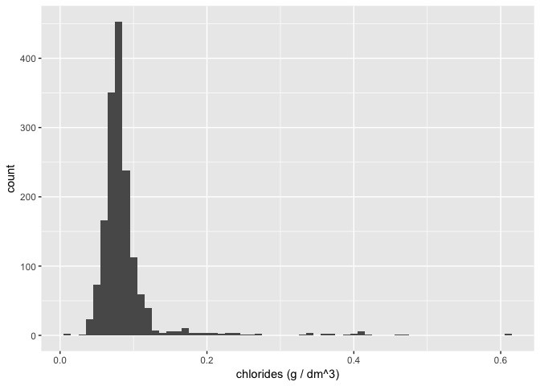
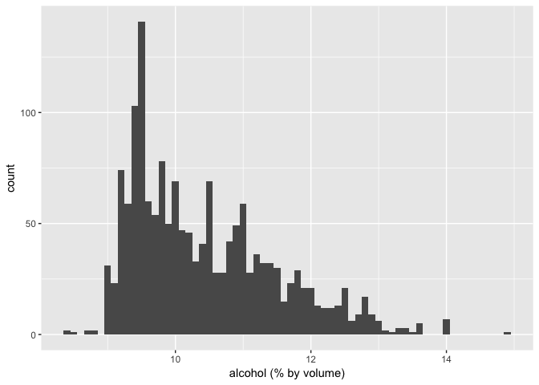
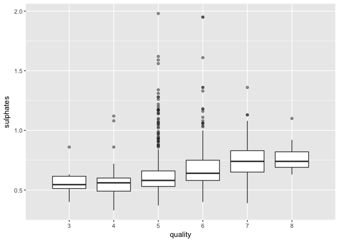
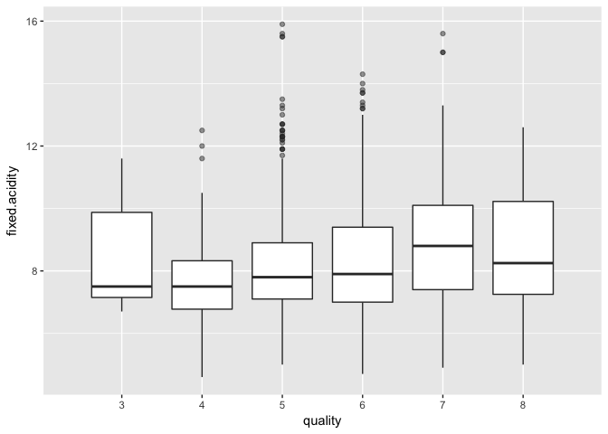
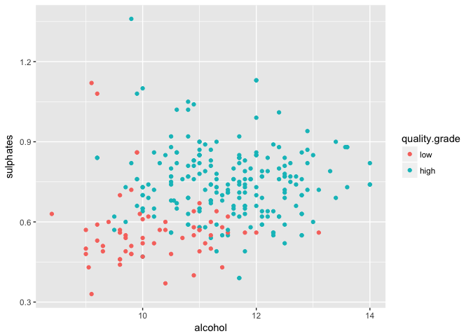

Wine Quality Exploration by James Lipe
======================================

> This clean dataset contains 1,599 red wines with 11 chemical
> properties of the wine and a quality rating between 0 (horrible) and
> 10 (exceptional).

Univariate Plots Section
========================

    ## 'data.frame':    1599 obs. of  13 variables:
    ##  $ X                   : int  1 2 3 4 5 6 7 8 9 10 ...
    ##  $ fixed.acidity       : num  7.4 7.8 7.8 11.2 7.4 7.4 7.9 7.3 7.8 7.5 ...
    ##  $ volatile.acidity    : num  0.7 0.88 0.76 0.28 0.7 0.66 0.6 0.65 0.58 0.5 ...
    ##  $ citric.acid         : num  0 0 0.04 0.56 0 0 0.06 0 0.02 0.36 ...
    ##  $ residual.sugar      : num  1.9 2.6 2.3 1.9 1.9 1.8 1.6 1.2 2 6.1 ...
    ##  $ chlorides           : num  0.076 0.098 0.092 0.075 0.076 0.075 0.069 0.065 0.073 0.071 ...
    ##  $ free.sulfur.dioxide : num  11 25 15 17 11 13 15 15 9 17 ...
    ##  $ total.sulfur.dioxide: num  34 67 54 60 34 40 59 21 18 102 ...
    ##  $ density             : num  0.998 0.997 0.997 0.998 0.998 ...
    ##  $ pH                  : num  3.51 3.2 3.26 3.16 3.51 3.51 3.3 3.39 3.36 3.35 ...
    ##  $ sulphates           : num  0.56 0.68 0.65 0.58 0.56 0.56 0.46 0.47 0.57 0.8 ...
    ##  $ alcohol             : num  9.4 9.8 9.8 9.8 9.4 9.4 9.4 10 9.5 10.5 ...
    ##  $ quality             : int  5 5 5 6 5 5 5 7 7 5 ...

    ##        X          fixed.acidity   volatile.acidity  citric.acid   
    ##  Min.   :   1.0   Min.   : 4.60   Min.   :0.1200   Min.   :0.000  
    ##  1st Qu.: 400.5   1st Qu.: 7.10   1st Qu.:0.3900   1st Qu.:0.090  
    ##  Median : 800.0   Median : 7.90   Median :0.5200   Median :0.260  
    ##  Mean   : 800.0   Mean   : 8.32   Mean   :0.5278   Mean   :0.271  
    ##  3rd Qu.:1199.5   3rd Qu.: 9.20   3rd Qu.:0.6400   3rd Qu.:0.420  
    ##  Max.   :1599.0   Max.   :15.90   Max.   :1.5800   Max.   :1.000  
    ##  residual.sugar     chlorides       free.sulfur.dioxide
    ##  Min.   : 0.900   Min.   :0.01200   Min.   : 1.00      
    ##  1st Qu.: 1.900   1st Qu.:0.07000   1st Qu.: 7.00      
    ##  Median : 2.200   Median :0.07900   Median :14.00      
    ##  Mean   : 2.539   Mean   :0.08747   Mean   :15.87      
    ##  3rd Qu.: 2.600   3rd Qu.:0.09000   3rd Qu.:21.00      
    ##  Max.   :15.500   Max.   :0.61100   Max.   :72.00      
    ##  total.sulfur.dioxide    density             pH          sulphates     
    ##  Min.   :  6.00       Min.   :0.9901   Min.   :2.740   Min.   :0.3300  
    ##  1st Qu.: 22.00       1st Qu.:0.9956   1st Qu.:3.210   1st Qu.:0.5500  
    ##  Median : 38.00       Median :0.9968   Median :3.310   Median :0.6200  
    ##  Mean   : 46.47       Mean   :0.9967   Mean   :3.311   Mean   :0.6581  
    ##  3rd Qu.: 62.00       3rd Qu.:0.9978   3rd Qu.:3.400   3rd Qu.:0.7300  
    ##  Max.   :289.00       Max.   :1.0037   Max.   :4.010   Max.   :2.0000  
    ##     alcohol         quality     
    ##  Min.   : 8.40   Min.   :3.000  
    ##  1st Qu.: 9.50   1st Qu.:5.000  
    ##  Median :10.20   Median :6.000  
    ##  Mean   :10.42   Mean   :5.636  
    ##  3rd Qu.:11.10   3rd Qu.:6.000  
    ##  Max.   :14.90   Max.   :8.000

An initial summary gives an overview of the data set.

    ##    Min. 1st Qu.  Median    Mean 3rd Qu.    Max. 
    ##   0.900   1.900   2.200   2.539   2.600  15.500

The distribution of quality is normally shaped with a low of 3 and a
high of 8. Most observations are either a 5 or 6. The possible values of
quality score that could have been given were from 0 to 10.

Residual sugar is positively skewed, plotting a box plot of the data
will help make sense of the distribution.

The box plot above shows the very large number of positive outliers. The
number of outliers is calculated and printed out below.

    ## Number of positive outliers:  155 
    ## Number of negative outliers:  0

For a data set of 1,599 observations that makes %9.7 of the data
outliers. This is clearly not an error in measurement and the outliers
will remain in the data set.

The chloride distribution is positively skewed and its box plot is
below.

The chloride distribution looks a lot like the residual sugar
distribution, with the addition of some outliers in the negative
direction as well. The number of positive and negative outliers is
printed below.

    ## Number of positive outliers:  103 
    ## Number of negative outliers:  9

These outliers seem like valid measurements and will be left in the data
set.

Sulphate distribution is also positively skewed but the distribution is
more compact than the that of sugars or chlorides. Once again a box plot
can help visualize outliers.

    ## Number of positive outliers:  59 
    ## Number of negative outliers:  0

The 59 sulphate outliers will remain in the data set.

Alcohol % data looks slightly positively skewed based on the histogram
above.

    ## Number of positive outliers:  13 
    ## Number of negative outliers:  0

There are only 13 outliers for the alcohol distribution.

The fixed acidity distribution looks slightly positively skewed.

    ## Number of positive outliers:  49 
    ## Number of negative outliers:  0

The volatile acid distribution looks bimodal with a positive skew.

    ## Number of positive outliers:  19 
    ## Number of negative outliers:  0

The spikes at 0.0 and 0.5 indicate a measurement rounding. There is also
a slight spike at 0.25, this should be taken into account when
discussing the citric acid data.

    ## Number of positive outliers:  1 
    ## Number of negative outliers:  0

The one positive outlier of 1.0, combined with the observed spikes at
0.0, 0.25 and 0.5 does indicate a observation that should be removed
from the data set. This value is removed for the remainder of this
investigation.

    ## Number of positive outliers:  30 
    ## Number of negative outliers:  0

These outliers are believed to be valid measurements and are left in the
data set.

Total sulfur dioxide is again positively skewed. There are a few
observations near 300 that look very far removed from the rest of the
distribution.

    ## Number of positive outliers:  55 
    ## Number of negative outliers:  0

There are more outliers than just the two near 300 mg/dm^3. The two
outliers near 300 are so large they are likely errors and will be
removed from the data set.

The density plot looks normally distributed.

    ## Number of positive outliers:  24 
    ## Number of negative outliers:  21

The pH distribution looks slightly positively skewed.

    ## Number of positive outliers:  21 
    ## Number of negative outliers:  13

Instead of looking at total sulfur dioxide and free sulfur dioxide a new
variable can be created that is the ratio of free sulfur dioxide.

Sulfur dioxide ratio is normally distributed. The spike at 0.25 and
possibly at 0.5 and 0.75 should be noted as possible measurement
rounding.

    ## Number of positive outliers:  4 
    ## Number of negative outliers:  0

A variable that may be of interest is the total acid content. This is
created by summing citric, volatile, and fixed acidity.

The total acidity distribution is again positively skewed. This could be
expected because the acid distributions were positively skewed as well.

    ## Number of positive outliers:  44 
    ## Number of negative outliers:  0

To gain information about which variables affect wine quality the data
has a ordered factor added of low, medium, and high quality added. A
low, medium, and high quality wine is defined as a score of 3 or 4, 5 or
6, and 7 or 8 respectively.

### High quality summary

    ##        X          fixed.acidity    volatile.acidity  citric.acid    
    ##  Min.   :   8.0   Min.   : 4.900   Min.   :0.1200   Min.   :0.0000  
    ##  1st Qu.: 470.5   1st Qu.: 7.400   1st Qu.:0.3100   1st Qu.:0.3000  
    ##  Median : 930.0   Median : 8.800   Median :0.3700   Median :0.4000  
    ##  Mean   : 829.4   Mean   : 8.856   Mean   :0.4065   Mean   :0.3737  
    ##  3rd Qu.:1089.5   3rd Qu.:10.150   3rd Qu.:0.4900   3rd Qu.:0.4900  
    ##  Max.   :1585.0   Max.   :15.600   Max.   :0.9150   Max.   :0.7600  
    ##  residual.sugar    chlorides       free.sulfur.dioxide
    ##  Min.   :1.200   Min.   :0.01200   Min.   : 3.00      
    ##  1st Qu.:2.000   1st Qu.:0.06200   1st Qu.: 6.00      
    ##  Median :2.300   Median :0.07300   Median :11.00      
    ##  Mean   :2.657   Mean   :0.07615   Mean   :13.76      
    ##  3rd Qu.:2.700   3rd Qu.:0.08550   3rd Qu.:17.00      
    ##  Max.   :8.900   Max.   :0.35800   Max.   :54.00      
    ##  total.sulfur.dioxide    density             pH          sulphates     
    ##  Min.   :  7.00       Min.   :0.9906   Min.   :2.880   Min.   :0.3900  
    ##  1st Qu.: 17.00       1st Qu.:0.9947   1st Qu.:3.200   1st Qu.:0.6550  
    ##  Median : 26.00       Median :0.9958   Median :3.280   Median :0.7400  
    ##  Mean   : 32.58       Mean   :0.9961   Mean   :3.291   Mean   :0.7456  
    ##  3rd Qu.: 43.00       3rd Qu.:0.9974   3rd Qu.:3.380   3rd Qu.:0.8250  
    ##  Max.   :106.00       Max.   :1.0032   Max.   :3.780   Max.   :1.3600  
    ##     alcohol         quality      sulfur.dioxide.ratio total.acidity   
    ##  Min.   : 9.20   Min.   :7.000   Min.   :0.1364       Min.   : 5.320  
    ##  1st Qu.:10.80   1st Qu.:7.000   1st Qu.:0.3333       1st Qu.: 8.100  
    ##  Median :11.60   Median :7.000   Median :0.4474       Median : 9.470  
    ##  Mean   :11.51   Mean   :7.084   Mean   :0.4365       Mean   : 9.636  
    ##  3rd Qu.:12.20   3rd Qu.:7.000   3rd Qu.:0.5353       3rd Qu.:10.990  
    ##  Max.   :14.00   Max.   :8.000   Max.   :0.7556       Max.   :17.045  
    ##  quality.grade
    ##  low   :  0   
    ##  medium:  0   
    ##  high  :215   
    ##               
    ##               
    ## 

### Low quality summary

    ##        X          fixed.acidity    volatile.acidity  citric.acid    
    ##  Min.   :  19.0   Min.   : 4.600   Min.   :0.2300   Min.   :0.0000  
    ##  1st Qu.: 474.5   1st Qu.: 6.800   1st Qu.:0.5800   1st Qu.:0.0200  
    ##  Median : 853.5   Median : 7.500   Median :0.6800   Median :0.0750  
    ##  Mean   : 848.7   Mean   : 7.850   Mean   :0.7275   Mean   :0.1603  
    ##  3rd Qu.:1289.8   3rd Qu.: 8.375   3rd Qu.:0.8838   3rd Qu.:0.2675  
    ##  Max.   :1522.0   Max.   :12.500   Max.   :1.5800   Max.   :0.6600  
    ##  residual.sugar     chlorides       free.sulfur.dioxide
    ##  Min.   : 1.200   Min.   :0.04500   Min.   : 3.00      
    ##  1st Qu.: 1.900   1st Qu.:0.06825   1st Qu.: 5.00      
    ##  Median : 2.100   Median :0.08000   Median : 9.00      
    ##  Mean   : 2.673   Mean   :0.08744   Mean   :11.74      
    ##  3rd Qu.: 2.750   3rd Qu.:0.09200   3rd Qu.:15.00      
    ##  Max.   :12.900   Max.   :0.26700   Max.   :41.00      
    ##  total.sulfur.dioxide    density             pH          sulphates     
    ##  Min.   :  7.00       Min.   :0.9934   Min.   :3.050   Min.   :0.3300  
    ##  1st Qu.: 13.25       1st Qu.:0.9957   1st Qu.:3.303   1st Qu.:0.4925  
    ##  Median : 25.00       Median :0.9966   Median :3.380   Median :0.5600  
    ##  Mean   : 33.89       Mean   :0.9966   Mean   :3.395   Mean   :0.5695  
    ##  3rd Qu.: 47.75       3rd Qu.:0.9976   3rd Qu.:3.500   3rd Qu.:0.6000  
    ##  Max.   :119.00       Max.   :1.0010   Max.   :3.900   Max.   :1.1200  
    ##     alcohol         quality      sulfur.dioxide.ratio total.acidity   
    ##  Min.   : 8.40   Min.   :3.000   Min.   :0.0531       Min.   : 5.270  
    ##  1st Qu.: 9.60   1st Qu.:4.000   1st Qu.:0.2760       1st Qu.: 7.572  
    ##  Median :10.00   Median :4.000   Median :0.3980       Median : 8.325  
    ##  Mean   :10.23   Mean   :3.839   Mean   :0.3942       Mean   : 8.738  
    ##  3rd Qu.:11.00   3rd Qu.:4.000   3rd Qu.:0.5000       3rd Qu.: 9.330  
    ##  Max.   :13.10   Max.   :4.000   Max.   :0.7083       Max.   :13.450  
    ##  quality.grade
    ##  low   :62    
    ##  medium: 0    
    ##  high  : 0    
    ##               
    ##               
    ## 

Univariate Analysis
===================

### What is the structure of your dataset?

There are 1599 red wines in this data set with 12 features (fixed
acidity, volatile acidity, citric acid, residual sugar, chlorides, free
sulfur dioxide, total sulfur dioxide, density, pH, sulphates, alcohol,
and quality)

All properties with the exception of quality are chemical properties of
the wine. Quality is a score between 1 and 10 rated by at least 3 wine
experts.

Observations:

-   The quality score ranges from 3 to 8 with most wines being scored a
    5 or 6

-   The median quality is a 6, the mean is a 5.636

-   Residual sugar, chlorides, sulphates, fixed acidity, and sulfur
    dioxide are long tailed data

### What is/are the main feature(s) of interest in your dataset?

The main feature of interest in the data set is the quality score.
Although quality is a subjective measure it is the ultimate thing of
interest to wine manufacturers and consumers. Additionally, alcohol
content is another variable of interest to some wine consumers. Some may
value a high alcohol content wine even if it results in a lower quality
score.

### What other features in the dataset do you think will help support your  
investigation into your feature(s) of interest?

Investigating the chemical properties of the wine and their affect on
quality is the goal of this analysis. Based on the univariate plots and
summary data it appears that the main properties affecting quality are
acid content, alcohol content, and sulphates. These relationships are
explored further in the bivaraite and multivariate sections.

### Did you create any new variables from existing variables in the dataset?

A new variable sulfur dioxide ratio was created from free sulfur dioxide
and total sulfur dioxide. A variable of total acid content was created
from the sum of volatile, free, and citric acid. A ordered factor was
created from the quality variable with low, medium, and high quality
wines being scored a 3 or 4, 5 or 6, and 7 or 8 respectively.

### Of the features you investigated, were there any unusual distributions?  
Did you perform any operations on the data to tidy, adjust, or change the form  
of the data? If so, why did you do this?

An observation was removed because the citric acid content was much
higher than the rest of the distribution and was likely rounded up. Two
observations were removed because their total sulfur dioxide content was
almost twice what the next highest observation was.

Residual sugar, chlorides, sulphates, and sulfur dioxide are all
positively skewed long tailed data.

Volatile acidity looks to be a bimodal distribution. The strangest
distribution is with the citric acid content; there are large spikes at
0, .25 and .5 g/dm^3. This citric acid distribution is likely because of
measurement rounding.

Bivariate Plots Section
=======================

Plotting each variable against one another is a good way to start the
bivariate analysis.

Looking at the correlation values, quality is positively correlated with
alcohol, sulphates, and citric acid. Quality is negatively correlated
with volatile acidity. Alcohol is positively correlated with pH and
negatively correlated with total sulfur dioxide, chlorides and volatile
acidity. These will be the relationships the bivariate analysis focuses
on.

Plotting the correlated variables on box plots split by quality score
can provide insight into quality trends.

Higher quality wine has a higher alcohol content

The sulphate distribution contains many outliers for qualities of 5 or
6. The trend for the median value is higher sulphate content correlates
with higher quality.

The citric acid content is clearly increasing as quality increases.

The fixed acidity plot is not revealing a clear trend related to
quality.

It is not clear from this box plot how total acidity relates to quality.

Volatile acid content is clearly decreasing as quality increases.

Splitting the data into high and low quality and plotting a box plot
over the distribution makes these correlations clearer.

The plots above make the affects of volatile acidity, alcohol, and
citric acidity on quality clearer. High quality wines have a low
volatile acidity, high alcohol content and low citric acidity compared
to low quality wines.

The other variable of interest, alcohol, is a continuous variable and
better explored using scatter plots.

The relationships between alcohol and its correlated variables is not
clear from the scatter plots.

Bivariate Analysis
==================

### Talk about some of the relationships you observed in this part of the  
investigation. How did the feature(s) of interest vary with other features in  
the data set?

The feature of interest in the data set (quality) varied with alcohol
content, volatile acidity, citric acid, and suphates. The strongest
correlations are with alcohol content, volatile acidity and citric acid
content.

When looking at the distributions of volatile acidity split by quality
grade outliers can be seen for both high and low quality wines. However,
5 of the 6 outliers for the high quality wines aren't even larger than
Q3 for the low quality wines.

Looking at the citric acid content of the high quality wines it is
observed that although the median of the distribution lies higher than
the low quality wines, there are a significant number of low values.
There are even some outliers in the high quality distribution with a
citric acid content of 0.

### What was the strongest relationships you found?

The strongest relationship found is between the alcohol content and the
quality. As alcohol content increases so does the quality of the wine.
The other strong relationships are between citric acid content and
quality; and volatile acid content and quality. As citric acid content
increases so does the quality of wine. As volatile acid content
decreases so does the quality of the wine.

Multivariate Plots Section
==========================

The side by side plots of variables of interest vs. alcohol split by
quality grade make the relationships clearer. As noted before, the
horizontal lines on the citric acid plots are visible. The low quality
wines are split with about half having a volatile acidity of above 0.8
g/dm^3, almost all the high quality wines have volatile acidity lower
than 0.8 g/dm^3.

Removing the medium quality wines (score 5 or 6) and coloring the low
and high quality wines makes it easier to visualize the relationship
between quality, and the variables of interest.

Multivariate Analysis
=====================

### Talk about some of the relationships you observed in this part of the  
investigation. Were there features that strengthened each other in terms of  
looking at your feature(s) of interest?

By looking at separated values of low and high quality wines the
relationship between these variables is made clearer. Low citric acid
content correlates with low quality wine (with the exception of some
outliers). High alcohol content and high citric acid content correlate
with high quality wine.

### Were there any interesting or surprising interactions between features?

It is surprising that high alcohol content correlates with high quality.
It is interesting that citric acid plays such an important role in
determining the quality of the wine.

Final Plots and Summary
=======================

### Plot One

### Description One

This box plot was chosen because it shows the relationship between
quality and citric acid content. As quality increases so does citric
acidity.

### Plot Two

### Description Two

An interesting feature of this plot is that as total acidity increases,
volatile acidity decreases. Since total acidity is a function of
volatile acidity, this result was unexpected. This plot was chosen
because it shows that high quality wines have both low and high total
acidity. However, mostly the low quality wines have high volatile
acidity. This demonstrates that the decline in wine quality as acid
content increases is not because of the increase in acidity, but in the
decrease of volatile acidity and the increase in citric acid content.

### Plot Three

### Description Three

This plot was chosen because it conveys one of the most interesting
findings of this investigation. As alcohol content increases so does the
quality of wine. High and medium quality wine are both above and below
%12 alcohol, but above %12 all the wine (with the exception of one) is
either high or medium quality.

------------------------------------------------------------------------

Reflection
==========

This exploratory data analysis produced some interesting findings about
what variables affect wine quality. The clearest findings are that
volatile acid content negatively affects quality, citric acid and
alcohol content positively affect wine quality.

Total acidity doesn't seem to have much of an affect on the quality
outcome. This could be because as total acidity increases it is because
of an increase in both citric acid and volatile acidity. Since these are
oppositely correlated they could be cancelling each other out and not
affecting quality.

There are only 1599 wines in this data set, with 1,319 of those falling
in the medium quality category. This left the investigation with a
relatively low amount of wines in the low and high quality category.
Additionally, the distribution of quality scores ranged from 3 to 8, it
would be interesting to see how wines that score 9 or 10 would compare
with the results found in this investigation.

It is also important to note that the quality of wine is a subjective
measure. Who were the wine experts judging these wines? It is possible
they have a taste for wine with a high citric acid content and high
alcohol.
